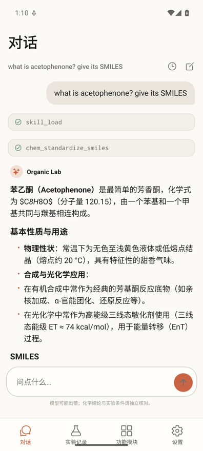
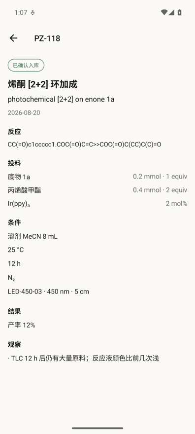
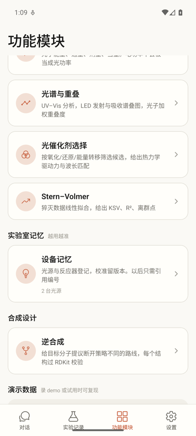
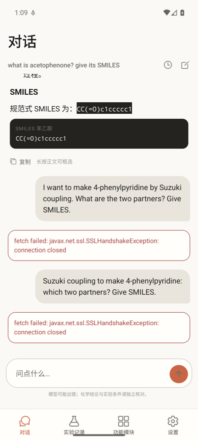

# Organic Lab Mobile

**面向有机合成课题组的本地 AI 研究助手。装上、填一组 API 信息就能用——不登录、不需要服务器、不需要 Docker，实验数据只存在你自己的手机上。**

> A local-first AI agent for synthetic organic chemistry. Install it, enter any
> OpenAI-compatible endpoint, and it runs — no account, no server, no Docker.
> Your experimental records never leave the device.

[](https://github.com/lipz666/organic-lab-mobile/releases)
[](LICENSE)

---

## 定位

目标是一套**有机合成领域的 Agent 系统**：能读懂化学、记得住本组做过什么、在设计路线和排查失败时给得出有依据的下一步。

光化学是其中一个分支。当前发布的安装包是**光化学版本**——在通用能力之上叠了一层针对光反应的求解器。同一套架构可以按方向再分出别的版本。

```
                    有机合成 Agent 系统
                          │
        ┌─────────────────┼─────────────────┐
     化学感知对话      实验记录 ELN         逆合成
        │                 │                 │
        └─────────────────┼─────────────────┘
                          │
                    ┌─────┴─────┐
                  光化学      （其他方向）
                   分支
```

---

## 核心功能

### 化学感知的对话



不是套壳聊天框。模型可以调用确定性化学工具，过程在界面上可见：

- **结构自动可视化** —— 回答里提到的分子由 RDKit 画成结构图，直接附在对话下面。抽取判据刻意保守，`DMSO`、`THF`、`acetophenone` 这类词不会被误当成 SMILES
- **确定性计算交给代码** —— SMILES 规范化、InChIKey、分子量、当量与计量、结构相似度，都不让模型心算
- **领域规范按需载入** —— 十份操作规范（实验记录、先例检索、条件筛选、结构书写等）随问题渐进披露，不是一次性塞进提示词
- **上下文按轮次裁剪** —— 超长时丢最早的轮次，但**保证工具调用与结果成对**，拆散了下一轮会直接失败

回答里区分**本组记录 / 文献 / 模型推断**三类来源，不把推测说成事实。

<br clear="right" />

### 实验记录 ELN 化



拍一页纸质记录本，多模态模型识读成结构化字段，**逐字段核对后入库**。

- 一次识读能拿到：实验编号、日期、目的、反应 SMILES、投料与当量、溶剂、温度、时间、气氛、光源参数、产率、观察、备注
- 取代了服务器版几百 MB 的 OCSR 模型（MolScribe / DECIMER / RxnScribe），不需要任何基础设施
- **照片上没写的字段留空**，不按常规值补、不做单位换算——补出来的数字会被当成实验事实
- 草稿与正式记录同表、以状态区分。把状态改成"已确认"的函数**不在工具列表里**，只有确认页能调用
- 已确认的记录不允许静默覆盖，要改走修订版本

积累下来的记录不是终点，而是后续诊断与检索的输入。

<br clear="right" />

### 逆合成



给目标分子，提出断开策略互不相同的路线。

- **每一步都是单步反应** —— 一次操作、一套条件、一个可分离产物。提示词里明确禁止一锅法与串联写法，解析层还会检出"偶联后水解"这类把多步压成一步的描述
- **前体必须真能买到** —— 起始原料对照两层砌块库：286 条常备试剂命名表（负责可读性）+ ZINC20 现货库 195 万条的 Bloom 索引（负责覆盖面，3.2 MB，无假阴性）
- **每个结构过 RDKit 校验** —— 读不出的路线标为不可用，因为它画不出图也比不了相似度
- **合成经验进提示词** —— 十六条课题组给定的断键与策略判断（汇聚优先、SNAr 替代金属偶联、保护基务实使用、氧化还原经济性等）
- 支持在目标分子之外附加自由文本要求，例如"避免有机锡试剂""手性中心用不对称氢化建立"

<br clear="right" />

---

## 光化学分支

当前版本在上述通用能力之上，叠了一层针对光反应的模块。



| | |
|---|---|
| **反应诊断** | 带上本组相似记录、设备清单和光子预算，排出失败假设并设计能区分它们的下一组实验。建议实验可一键存为草稿 |
| **光子预算** | 光子能量、通量、剂量、当量。**电功率不会被当成光功率** |
| **光谱与重叠** | UV–Vis 分析，LED 发射与吸收谱叠图，光子加权重叠度 |
| **光催化剂选择** | 按氧化 / 还原 / 能量转移筛选，给出热力学驱动力与波长匹配，每个数值都带测量溶剂与参比电极 |
| **Stern–Volmer** | 猝灭数据线性拟合，KSV、R²、离群点（用 MAD 而非标准差，避免离群点自我掩蔽） |
| **条件优化** | 录入已做条件与结果，给出下一批实验。每条只改一个变量，并标明是归因、精调还是探索 |
| **设备记忆** | 光源与反应器登记，校准留版本。标称值与实测值分开，正式实验引用的是版本 |

<br clear="right" />

---

## 设计上不肯让步的几件事

**模型只能产出草稿，写入是人的动作。** 实验记录的状态从"草稿"变成"已确认"只有一个函数能做，它不在工具列表里。逆合成路线同理——模型能提议能展开，保存是界面上的按钮。

**不替用户补数字。** 照片上没写的字段就是空的。模型曾把 `2 mol%` 自行折成 `equiv 0.02`，补出来的数字会被当成实验事实。

**电功率不是光功率。** 灯标称 30 W 指的是耗电，落到样品上的光功率通常低一个数量级且强烈依赖几何。没有实测值时程序**拒绝**给出光子通量，而不是假装算得出来。

**降级要说出来。** RDKit 起不来时结构工具退回语法检查，这件事必须出现在工具摘要里——悄悄降级比直接失败更糟。

**「没查」和「查了没有」是两回事。** 砌块不在库里只说明需自行确认供应商，不等于买不到；索引加载失败时措辞里不会出现 ZINC。

这些都有对应的回归测试守着。它们失败通常意味着某个边界被无意打穿了，而不是测试写错了。

---

## 安装

**Android**：从 [Releases](https://github.com/lipz666/organic-lab-mobile/releases)
下载最新的 `.apk`（arm64，约 62MB），传到手机点开安装。系统提示「未知来源」时允许一次
——这是自签名安装包的正常表现。

装好后到「设置」填 Base URL、API Key 和模型名，点「测试连接并保存」。
任何 OpenAI 兼容的接口都可以。首次启动会解压约 7MB 的 RDKit 模块，
设置页底部会显示「结构引擎：已就绪」。

**iOS** 目前需要自行构建，见 [docs/build.md](docs/build.md)。

## 从源码运行

```bash
npm install
```

```bash
npm run sync-skills && npm run build:ketcher
```

```bash
npm run android   # 或 npm run ios / npm run web
```

- **iOS** 需要完整版 Xcode
- **Android** 需要 JDK 17 与 Android SDK，见 [docs/build.md](docs/build.md)
- **Web** 只用于快速看 UI，不是发布目标（`expo-secure-store` 在 web 上不可用，Key 只留在内存）

## 验证

```bash
npm run verify
```

十套检查约 160 项。不需要网络的四套可以直接跑：

```bash
npm run verify:chem && npm run verify:bloom && npm run verify:context && npm run verify:ui && npm run verify:photo
```

其余需要在 `.env.verify.local` 里填一个可用的接口：

```
ORGANICLAB_BASE_URL=https://your-endpoint
ORGANICLAB_API_KEY=sk-...
ORGANICLAB_MODEL=your-model
```

**发包前还要在模拟器上跑一遍**——Node 覆盖不到 RDKit 真正运行的环境（release 构建是
Hermes 字节码，WebView 不是浏览器），这个盲区已经造成过两次只在真机上出现的故障。
详见 [docs/build.md](docs/build.md)。

## 架构

```
手机
├── UI (Expo Router)
├── Agent Loop (TypeScript)      ← 直连你填的模型端点
│   ├── Provider  流式 + 工具调用
│   ├── Skills    按需载入 skills/*.md
│   └── Tools     原生 TS 函数
├── SQLite                        实验记录、设备、优化任务
├── FileSystem                    照片附件
└── RDKit WASM（隐藏 WebView）    结构解析与出图
```

选 React Native 而不是 PWA，决定性理由是 **CORS**：浏览器无法直连任意模型端点，
而"填你自己的 API 信息"正要求它能。

更多见 [docs/architecture.md](docs/architecture.md)。

## 路线

已完成：化学感知对话、实验记录 ELN、逆合成、光化学分支（诊断 / 光子 / 光谱 / 催化剂 / 猝灭拟合 / 条件优化 / 设备记忆）。

计划中：文献条件迁移到本组设备、机理实验设计、量子产率、放大求解、以及光化学之外的其他方向分支。

## 文档

- [架构与设计决策](docs/architecture.md)
- [构建与发布](docs/build.md)
- [砌块库与可得性判定](docs/building-blocks.md)
- [参与贡献](CONTRIBUTING.md)
- [第三方组件与数据](NOTICE.md)

## 许可

MIT，见 [LICENSE](LICENSE)。第三方组件与数据的来源和引用要求见 [NOTICE.md](NOTICE.md)。
